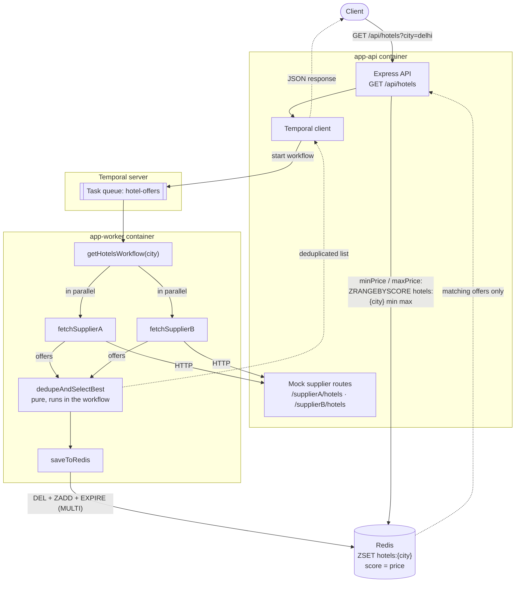

# Hotel Offer Orchestrator

Aggregates overlapping hotel offers from two suppliers, deduplicates them by
hotel name keeping the cheaper price, caches the result, and serves price-range
queries filtered **inside Redis**.

Orchestration runs on [Temporal](https://temporal.io/): the two supplier calls
fan out in parallel, and if one supplier is down the request still succeeds with
the other supplier's offers.

**Stack:** Node.js 20 · TypeScript (strict) · Express · Temporal.io · Redis ·
Docker Compose

---

## Architecture



- **The unfiltered path goes through Temporal**, and every side effect —
  supplier HTTP, the Redis write — happens inside an activity. Only the pure
  `dedupeAndSelectBest` runs in workflow code.
- **The filtered path reads Redis directly** from the API — not workflow code,
  so determinism doesn't apply and there's no reason to route a read back
  through Temporal. If the city isn't cached yet, the API runs the workflow
  first to populate Redis, then issues the same `ZRANGEBYSCORE`.

### Why Temporal

A `Promise.all` in a request handler could do the happy path in ten lines.
Temporal earns its place once failure enters the picture:

- **Retries are declarative.** Each supplier activity retries 3× with
  exponential backoff from a policy object; a 4xx is marked non-retryable. No
  retry loops or bespoke backoff in application code.
- **Partial failure is linear code.** "One supplier down still returns results,
  both down fails" reads like the requirement in a workflow, instead of nested
  try/catch around a `Promise.allSettled`.
- **Every run is inspectable.** When a request returns 6 offers instead of 8,
  the Temporal UI shows which activity failed, each retry, and the inputs and
  outputs — no local reproduction.
- **A crash mid-flight is recoverable.** Workflow state is durable; if the
  worker dies between fetching suppliers and writing Redis, Temporal replays
  from event history rather than losing the request.

The cost: one more moving part (a Temporal server and its datastore), and
workflow code must stay deterministic — which is why all I/O lives in activities.

### Why a Redis sorted set

Price filtering must happen _inside_ Redis, not by loading the catalogue into
Node. A sorted set makes that a one-liner:

```
ZADD hotels:delhi 4950 '{"name":"Holtin",...}'     # score = price
ZRANGEBYSCORE hotels:delhi 4000 9000               # the filter itself
```

- **The score _is_ the filter key** — range queries are the native ZSET
  operation, `O(log N + M)` rather than `O(N)` plus shipping every offer to the
  app to discard most of them.
- **Members are the finished offers**, so a range query returns complete results
  with no second lookup.
- **Results arrive price-ordered for free.**
- **Set semantics prevent duplicates** — member identity is the exact string, so
  a re-save can't produce two entries for the same hotel (`serializeOffer`
  writes keys in a fixed order to keep this stable).

A plain `SET`/`GET` of a JSON blob would force filtering in JavaScript; a `HASH`
gives O(1) lookup by name but no range query.

---

## Prerequisites

**With Docker (recommended)** — nothing else needed: Docker Engine 20.10+ and
Docker Compose v2 (`docker compose`, not `docker-compose`).

**Without Docker**, additionally: Node.js 20+ (uses global `fetch` and
`AbortSignal.timeout`), npm 9+, Redis 7+, and the Temporal CLI (for
`temporal server start-dev`).

---

## Quickstart with Docker

```bash
git clone <repo-url> && cd hotel-offer-orchestrator
docker compose up --build
```

No migrations, no seeding, no manual namespace creation. Compose builds the app
image, starts Postgres, Redis, the Temporal server and UI, waits for each
healthcheck, then starts the API and worker. Cold start is ~15 seconds.

```bash
# the deduplicated catalogue
curl 'http://localhost:3000/api/hotels?city=delhi'

# filtered inside Redis
curl 'http://localhost:3000/api/hotels?city=delhi&minPrice=4000&maxPrice=9000'

# live dependency probes
curl 'http://localhost:3000/health'
```

| Service     | URL                   |
| ----------- | --------------------- |
| API         | http://localhost:3000 |
| Temporal UI | http://localhost:8080 |
| Redis       | localhost:6379        |

Stop with `docker compose down`, or `docker compose down -v` to drop the volumes.

> **Host port already in use?** Copy `.env.example` to `.env` and set
> `API_HOST_PORT`, `TEMPORAL_UI_PORT`, `TEMPORAL_GRPC_PORT` or `REDIS_HOST_PORT`.
> Compose reads `.env` automatically.

---

## Local development without Docker

Four terminals. The API hosts the mock supplier routes, so the worker is told
where to find them.

```bash
# 0. dependencies
npm install

# 1. infrastructure
temporal server start-dev              # Temporal on :7233, UI on :8233
docker run --rm -d -p 6379:6379 redis:7-alpine

# 2. API (terminal 1)
SUPPLIER_A_URL=http://localhost:3000/supplierA/hotels \
SUPPLIER_B_URL=http://localhost:3000/supplierB/hotels \
npm run dev

# 3. Temporal worker (terminal 2)
SUPPLIER_A_URL=http://localhost:3000/supplierA/hotels \
SUPPLIER_B_URL=http://localhost:3000/supplierB/hotels \
npm run dev:worker

# 4. end-to-end smoke test (terminal 3)
npm run verify
```

`npm run verify` runs the workflow for `delhi`, `mumbai` and an unknown city and
asserts the expected winners, exiting non-zero if anything drifts. Everything
else defaults to `localhost:7233` and `redis://localhost:6379`.

### npm scripts

| Script                 | Does                                     |
| ---------------------- | ---------------------------------------- |
| `npm run dev`          | API with hot reload (tsx watch)          |
| `npm run dev:worker`   | Temporal worker with hot reload          |
| `npm run build`        | Compile TypeScript to `dist/`            |
| `npm run start:api`    | Run the compiled API                     |
| `npm run start:worker` | Run the compiled worker                  |
| `npm test`             | Unit + integration tests (vitest)        |
| `npm run lint`         | ESLint (type-aware)                      |
| `npm run typecheck`    | `tsc --noEmit`                           |
| `npm run verify`       | End-to-end check against a running stack |

---

## API reference

### `GET /api/hotels?city={city}`

Runs the Temporal workflow: both suppliers are called in parallel, results are
deduplicated by hotel name keeping the cheaper offer, and the list is cached in
Redis before being returned.

```bash
curl 'http://localhost:3000/api/hotels?city=delhi'
```

`200 OK`

```json
[
  { "name": "Andaz Delhi", "price": 10500, "supplier": "Supplier B", "commissionPct": 10 },
  { "name": "Bloomrooms Janpath", "price": 3100, "supplier": "Supplier A", "commissionPct": 18 },
  { "name": "Holtin", "price": 4950, "supplier": "Supplier B", "commissionPct": 9 },
  { "name": "Hyatt Regency", "price": 7250, "supplier": "Supplier B", "commissionPct": 13 },
  { "name": "Leela Palace", "price": 9800, "supplier": "Supplier A", "commissionPct": 15 },
  { "name": "Radison", "price": 6100, "supplier": "Supplier A", "commissionPct": 10 },
  { "name": "Taj Mahal Hotel", "price": 11900, "supplier": "Supplier B", "commissionPct": 7 },
  { "name": "The Imperial", "price": 8700, "supplier": "Supplier A", "commissionPct": 11 }
]
```

Six hotels from each supplier, four names overlapping, merging to eight offers:

| Hotel              | Supplier A | Supplier B | Winner                                  |
| ------------------ | ---------- | ---------- | --------------------------------------- |
| Holtin             | 5200       | **4950**   | B — cheaper                             |
| Radison            | **6100**   | 6400       | A — cheaper                             |
| Leela Palace       | **9800**   | 9800       | A — exact tie, broken deterministically |
| Taj Mahal Hotel    | 12400      | **11900**  | B — cheaper                             |
| The Imperial       | 8700       | —          | A only                                  |
| Bloomrooms Janpath | 3100       | —          | A only                                  |
| Hyatt Regency      | —          | 7250       | B only                                  |
| Andaz Delhi        | —          | 10500      | B only                                  |

Names are matched trimmed and case-insensitively. An exact price tie resolves to
Supplier A, independent of argument order. Output is sorted by name, so the same
query always returns the same bytes. `mumbai` is also populated; any other city
returns `[]`.

### `GET /api/hotels?city={city}&minPrice={min}&maxPrice={max}`

Same endpoint, filtered by price **inside Redis**. Both bounds are inclusive and
either may be omitted.

```bash
curl 'http://localhost:3000/api/hotels?city=delhi&minPrice=4000&maxPrice=9000'
```

```json
[
  { "name": "Holtin", "price": 4950, "supplier": "Supplier B", "commissionPct": 9 },
  { "name": "Hyatt Regency", "price": 7250, "supplier": "Supplier B", "commissionPct": 13 },
  { "name": "Radison", "price": 6100, "supplier": "Supplier A", "commissionPct": 10 },
  { "name": "The Imperial", "price": 8700, "supplier": "Supplier A", "commissionPct": 11 }
]
```

### `GET /supplierA/hotels?city={city}` · `GET /supplierB/hotels?city={city}`

The mock supplier feeds, returning raw records before normalization.

```json
[{ "hotelId": "A-DEL-001", "name": "Holtin", "price": 5200, "city": "delhi", "commissionPct": 12 }]
```

Two test switches: `?delayMs=1500` simulates latency (makes the parallel fan-out
visible), and `?fail=1` returns 503 to exercise degradation.

### Errors

Every error uses one shape:

```json
{
  "error": "invalid_price_range",
  "message": "minPrice must be less than or equal to maxPrice",
  "details": { "min": 9000, "max": 4000 }
}
```

| Condition                          | Status | `error`                 |
| ---------------------------------- | ------ | ----------------------- |
| `city` missing or empty            | 400    | `city_required`         |
| Bound not a number, or negative    | 400    | `invalid_price`         |
| `minPrice > maxPrice`              | 400    | `invalid_price_range`   |
| Unknown route                      | 404    | `not_found`             |
| Both suppliers unavailable         | 502    | `suppliers_unavailable` |
| Workflow failed for another reason | 502    | `workflow_failed`       |
| Redis unreachable                  | 503    | `redis_unavailable`     |
| Temporal unreachable               | 503    | `temporal_unavailable`  |

An unknown city is **not** an error — it returns `200 []`. Every response carries
an `x-request-id` header (reused if the client sends one), which appears in every
log line for the request.

---

## Interactive API docs (Swagger)

Served by the API itself — no extra container, no separate build step.

| Interactive UI           | http://localhost:3000/api-docs      |
| ------------------------ | ----------------------------------- |
| Raw OpenAPI 3.0 document | http://localhost:3000/api-docs.json |

Every endpoint is documented with parameters, response schemas and realistic
examples, grouped under **Hotels**, **Health** and **Suppliers (mock)**. **Try
it out** works against the running instance. The contract lives in one typed
object, `src/api/openapi.ts`, typed as `OpenAPIV3.Document` so a malformed spec
is a compile error; `test/openapi.test.ts` fails if a `$ref` dangles.

---

## How in-Redis filtering works

A city's deduplicated catalogue is stored as a sorted set scored by price:

```
hotels:{city}        ZSET     score = price, member = serialized HotelOffer
hotels:{city}:meta   STRING   {"count":8,"savedAt":"..."}   — the "is cached?" marker
```

Writing (in `saveToRedis`, inside one `MULTI`):

```
MULTI
  DEL    hotels:delhi
  ZADD   hotels:delhi 3100 '{"name":"Bloomrooms Janpath",...}' 4950 '{"name":"Holtin",...}' ...
  EXPIRE hotels:delhi 300
  SET    hotels:delhi:meta '{"count":8,...}' EX 300
EXEC
```

Reading: `ZRANGEBYSCORE hotels:delhi 4000 9000`.

- **Replace, never merge.** `DEL` + `ZADD` in one transaction means a reader sees
  the old snapshot or the new one, never half of either — and re-running the
  activity leaves identical state, which is what makes it safe under Temporal's
  at-least-once execution.
- **The meta key marks "cached", not the sorted set** — a city with no hotels has
  no sorted set, so without a separate marker every unknown-city request would
  re-run the workflow.
- **Omitted bounds become `-inf` / `+inf`**, passed straight to Redis.
- **Results are re-sorted by name after reading**, so a filtered response is
  byte-identical to one served straight from the workflow.
- **A filtered cache miss** runs the workflow for its populating side effect,
  then issues the same `ZRANGEBYSCORE` — hit and miss share one code path.

---

## How graceful degradation works

The workflow settles each supplier call separately rather than using
`Promise.all`, which would reject on the first failure.

| Situation              | Result                                                                    |
| ---------------------- | ------------------------------------------------------------------------- |
| Both suppliers respond | Full catalogue — 8 offers for `delhi`                                     |
| **One supplier fails** | **200 with the other supplier's offers**, warning logged, snapshot cached |
| Both suppliers fail    | `502 suppliers_unavailable`                                              |
| Redis write fails      | Request fails (see below)                                                 |

By the time the workflow sees a rejection, Temporal has already exhausted the
retry policy, so it genuinely means the supplier is unavailable. A degraded run
still caches its partial snapshot — it's the best data available.

**A Redis failure fails the request** rather than returning uncached results.
Redis is the read path for filtered queries, so quietly returning data that was
never cached would let a later `minPrice`/`maxPrice` request serve missing
results with no indication anything was wrong.

Reproduce it — the worker reads supplier URLs at startup, so point it at the
failing URL:

```bash
docker compose run --rm \
  -e SUPPLIER_A_URL='http://app-api:3000/supplierA/hotels?fail=1' \
  app-worker node dist/temporal/worker.js

curl 'http://localhost:3000/api/hotels?city=delhi'   # 200, 6 offers, all "Supplier B"
curl 'http://localhost:3000/health'                  # "status": "degraded"
```

---

## Health checks

`GET /health` actively probes **both suppliers, Redis and Temporal** on every
call — nothing cached or inferred from config. All four run concurrently, so the
endpoint costs one timeout at worst.

```json
{
  "status": "ok",
  "suppliers": {
    "A": { "status": "up", "latencyMs": 9 },
    "B": { "status": "up", "latencyMs": 10 }
  },
  "redis": { "status": "up", "latencyMs": 3 },
  "temporal": { "status": "up", "latencyMs": 14 },
  "checkedAt": "2026-09-21T10:17:57.742Z",
  "uptimeSeconds": 21
}
```

A failing dependency carries the reason, e.g. `"A": { "status": "down", "error": "HTTP 503" }`.

| `status`   | HTTP | Meaning                                           |
| ---------- | ---- | ------------------------------------------------- |
| `ok`       | 200  | Everything reachable                              |
| `degraded` | 200  | One supplier down — still serving, from the other |
| `down`     | 503  | Redis or Temporal down, or _both_ suppliers down  |

`degraded` deliberately stays **200**: losing one supplier is exactly the failure
the workflow absorbs, so returning 503 would pull a capable container out of
rotation. Compose uses this endpoint as the `app-api` healthcheck.

---

## Running the tests

```bash
npm test
```

| Suite                                   | Covers                                                                                                                                                                 |
| --------------------------------------- | ---------------------------------------------------------------------------------------------------------------------------------------------------------------------- |
| `test/dedupe.test.ts`                   | Cheaper wins both directions, exact tie resolving to Supplier A regardless of argument order, A-only/B-only passthrough, empty inputs, case/whitespace matching, deterministic ordering, full delhi fixture |
| `test/repository.test.ts`               | Offer serialization round-trip, fixed key order, rejection of malformed members                                                                                        |
| `test/redis-filter.integration.test.ts` | The real `ZRANGEBYSCORE` path against a live Redis                                                                                                                      |

The integration test **skips itself** when no Redis is reachable, so `npm test`
is green on a bare machine. To include it:

```bash
docker compose up -d redis
npm test
# or point elsewhere: REDIS_URL=redis://localhost:6381 npm test
```

It uses its own key prefix (`test-hotels:`) and cleans up after itself. It
asserts inclusive bounds, `-inf`/`+inf` handling, empty ranges, no duplicate
names, replace-not-append on refresh, TTLs on both keys, and that a city with no
hotels is still marked as cached.

---

## Temporal UI

http://localhost:8080 (or http://localhost:8233 when running with
`temporal server start-dev`).

Open **Workflows**, select a `hotels:{city}` run, and the Event History shows the
whole execution: both supplier activities starting concurrently, every retry with
its input and output, the `saveToRedis` call, and the result. Each run's memo
carries the `requestId` of the HTTP request that started it, and the API logs the
`workflowId` and `runId`, so you can move between logs and UI in either direction.

---

## Postman collection

`postman/HotelOfferOrchestrator.postman_collection.json` (v2.1) with
`postman/HotelOfferOrchestrator.postman_environment.json`. Import both, or run
headless:

```bash
npx newman run postman/HotelOfferOrchestrator.postman_collection.json \
  -e postman/HotelOfferOrchestrator.postman_environment.json

# different port?
npx newman run postman/HotelOfferOrchestrator.postman_collection.json \
  --env-var baseUrl=http://localhost:3100
```

44 assertions across the valid city, both price-filter paths, a city with no
results, health, both raw supplier feeds, and a supplier-outage scenario. Every
request returning offers asserts the response shape and that **no hotel name
appears twice**. Run the requests in order — request 1 populates the cache
request 2 reads.

---

## Configuration

Everything is environment driven with working defaults; nothing is hardcoded and
no secrets live in the repo. See `.env.example`.

| Variable                            | Default                     | Purpose                                           |
| ----------------------------------- | --------------------------- | ------------------------------------------------- |
| `PORT`                              | `3000`                      | API port inside the container                     |
| `LOG_LEVEL`                         | `debug` (`info` in compose) | pino level                                        |
| `REDIS_URL`                         | `redis://localhost:6379`    | Redis connection                                  |
| `REDIS_KEY_PREFIX`                  | `hotels`                    | Key namespace                                     |
| `REDIS_TTL_SECONDS`                 | `300`                       | How long a city's snapshot is cached              |
| `REDIS_COMMAND_TIMEOUT_MS`          | `2000`                      | Upper bound on a single Redis command             |
| `TEMPORAL_ADDRESS`                  | `localhost:7233`            | Temporal frontend                                 |
| `TEMPORAL_NAMESPACE`                | `default`                   | Namespace                                         |
| `TEMPORAL_TASK_QUEUE`               | `hotel-offers`              | Queue shared by API and worker                    |
| `TEMPORAL_START_TIMEOUT_MS`         | `10000`                     | Bound on starting a workflow before returning 503 |
| `SUPPLIER_A_URL` / `SUPPLIER_B_URL` | localhost supplier routes   | Supplier endpoints                                |
| `SUPPLIER_TIMEOUT_MS`               | `5000`                      | Per-supplier request timeout                      |
| `SUPPLIER_HEALTH_TIMEOUT_MS`        | `2000`                      | Shorter budget for `/health` probes               |
| `SHUTDOWN_GRACE_MS`                 | `10000`                     | Grace period before a forced exit                 |

Compose-only host port overrides: `API_HOST_PORT`, `TEMPORAL_UI_PORT`,
`TEMPORAL_GRPC_PORT`, `REDIS_HOST_PORT`.

---

## Project layout

```
src/
  api/          Express app, middleware, routes, error mapping, health probes,
                openapi.ts (the API contract, single source of truth)
  temporal/     activities, workflow, worker, client, connect-with-retry
  suppliers/    mock supplier fixtures and their Express routes
  redis/        connection + sorted-set repository
  domain/       framework-free types and the pure dedup function
  config/       env parsing with defaults — the only place reading process.env
  scripts/      verify-workflow end-to-end check
  shutdown.ts   shared graceful-shutdown plumbing
  logger.ts     pino
test/           vitest suites
postman/        collection + environment
```

`domain/` depends on nothing, which is what lets `dedupeAndSelectBest` run safely
inside workflow code. Both processes handle SIGTERM/SIGINT: they stop taking new
work, drain in flight, close connections in order, and exit 0 (force-exit after
`SHUTDOWN_GRACE_MS`). On startup the Temporal client retries with exponential
backoff, because the frontend accepts gRPC slightly before the default namespace
finishes registering — but on the request path that retry is capped, so a request
fails fast with 503 rather than hanging.

---

## Troubleshooting

**`Bind for 0.0.0.0:3000 failed: port is already allocated`** — another process
holds the port. Copy `.env.example` to `.env` and change `API_HOST_PORT` (and/or
`TEMPORAL_UI_PORT`, `TEMPORAL_GRPC_PORT`, `REDIS_HOST_PORT`).

**`dependency failed to start: container ... is unhealthy`** — Temporal takes
longest on a cold start because it creates its schema. If Postgres was
interrupted mid-setup, a clean slate fixes it:
`docker compose down -v && docker compose up --build`.

**Code changes not showing up in Docker** — use
`docker compose up --build --force-recreate`.

**`503 temporal_unavailable` / `503 redis_unavailable`** — the API can't reach a
dependency. `docker compose ps` shows health; `curl localhost:3000/health`
reports it per-dependency. The API reconnects on its own once the dependency
returns.

**The price filter returns `[]` but the city has hotels** — the range may
genuinely be empty (delhi prices jump from 4950 to 6100, so
`minPrice=5000&maxPrice=6000` is correctly empty). Confirm with
`docker compose exec redis redis-cli ZRANGE hotels:delhi 0 -1 WITHSCORES`.

**Native module errors from `@temporalio/core-bridge`** — it ships prebuilt
glibc binaries, which is why the image is Debian slim; switching to Alpine breaks
the worker.
